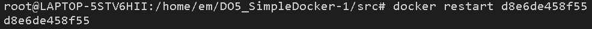

# Simple Docker

## Содержание

1. [Готовый докер](#part-1-готовый-докер)
2. [Операции с контейнером](#part-2-операции-с-контейнером)
3. [Мини веб-сервер](#part-3-мини-веб-сервер)
4. [Свой докер](#part-4-свой-докер)
5. [Dockle](#part-5-dockle)
6. [Базовый Docker Compose](#part-6-базовый-docker-compose)

## Part 1. Готовый докер

1. Загружаем официальный докер-образ **nginx** с помощью команды `docker pull nginx`.

2. Проверяем наличие докер-образа через `docker images`.

3. Запускаем докер-образ через `docker run -d nginx`

4. Проверяем, что образ запустился через `docker ps`.

5. Смотрим информацию о контейнере через `docker inspect [container_id]`.

6. По выводу команды определяем размер контейнера, список замапленных портов и ip контейнера.

7. Останавливаем докер образ через `docker stop [container_id]`.

8. Проверяем, что образ остановился через `docker ps`.

9. Запускаем докер с портами 80 и 443 в контейнере, замапленными на такие же порты на локальной машине, через команду *run*.

10. Проверяем, что в браузере по адресу *localhost:80* доступна стартовая страница **nginx**.

11. Перезапускаем докер контейнер через `docker restart [container_id]` и проверяем , что контейнер запустился.

## Part 2. Операции с контейнером

1. Читаем конфигурационный файл *nginx.conf* внутри докер контейнера через команду *exec*.

2. Создаём на локальной машине файл *nginx.conf* и настраиваем в нем по пути */status* отдачу страницы статуса сервера **nginx**..

3. Копируем созданный файл *nginx.conf* внутрь докер-образа через команду `docker cp`.

4. Перезапускаем **nginx** внутри докер-образа через команду *exec*.

5. Проверяем, что по адресу *localhost:80/status* отдается страничка со статусом сервера **nginx**.

6. Экспортируем контейнер в файл *container.tar* через команду *export*.

7. Останавливаем контейнер.

8. Удаляем образ через `docker rmi --force [image_id]`, не удаляя перед этим контейнеры.

9. Удаляем остановленный контейнер.

10. Импортируем контейнер обратно через команду *import*.

11. Запускаем импортированный контейнер.

12. Проверяем, что по адресу *localhost:80/status* отдается страничка со статусом сервера **nginx**.

## Part 3. Мини веб-сервер

1. Пишем мини-сервер на **C** и **FastCgi**, который будет возвращать простейшую страничку с надписью `Hello World!`.

2. Пишем свой *nginx.conf*, который будет проксировать все запросы с 81 порта на *127.0.0.1:8080*.

3. Перезапускаем nginx с написанным файлом nginx.conf (может понадобиться команда `sudo fuser -k 81/tcp`)

4. После компиляции .c файла (`gcc -o server.cgi server.c -lfcgi`) запускаем написанный мини-сервер через *spawn-fcgi* на порту 8080 (может понадобиться команда `sudo fuser -k 8080/tcp`).

5. Проверяем, что в браузере по *localhost:81* отдается написанная страничка.

## Part 4. Свой докер

1. Пишем свой докер-образ, который:
    1) собирает исходники мини сервера на FastCgi из [Части 3](#part-3-мини-веб-сервер);
    2) запускает его на 8080 порту;
    3) копирует внутрь образа написанный *./nginx/nginx.conf*;
    4) запускает **nginx**.

2. Собираем написанный докер-образ через `docker build` при этом указав имя и тег.

3. Проверяем через `docker images`, что все собралось корректно.

4. Запускаем собранный докер-образ с маппингом 81 порта на 80 на локальной машине и маппингом nginx.conf

5. Проверяем, что по localhost:80 доступна страничка написанного мини сервера.

6. Дописываем в *./nginx/nginx.conf* проксирование странички */status*, по которой надо отдавать статус сервера **nginx**.

7. Перезапускаем контейнер.

8. Проверяем, что nginx.conf изменился

9. Проверяем, что теперь по *localhost:80/status* отдается страничка со статусом **nginx**

## Part 5. **Dockle**

1. Сканируем образ из предыдущего задания через `dockle [image_id]`.

2. Исправляем образ так, чтобы при проверке через **dockle** не было ошибок и предупреждений.

3. Вывод команды `dockle` для исправленного Dockerfile

## Part 6. Базовый **Docker Compose**

1. Пишем файл *docker-compose.yml*, с помощью которого:
    1) Поднимаем докер-контейнер из [Части 5](#part-5-инструмент-dockle) _(он должен работать в локальной сети, т.е. не нужно использовать инструкцию **EXPOSE** и мапить порты на локальную машину)_.
    2) Поднимаем докер-контейнер с **nginx**, который будет проксировать все запросы с 8080 порта на 81 порт первого контейнера.
    3) Мапим 8080 порт второго контейнера на 80 порт локальной машины.

* Нужно закомментировать некоторые строчки в Dockerfile.fixed 

* Вид nginx.conf файла для второго контейнера

2. Останавливаем все запущенные контейнеры командой `docker stop $(docker ps -a -q)`
3. Собираем и запускаем проект с помощью команд `docker-compose build` и `docker-compose up`.

4. Проверяем, что в браузере по *localhost:80* отдается написанная страничка, как и ранее.

